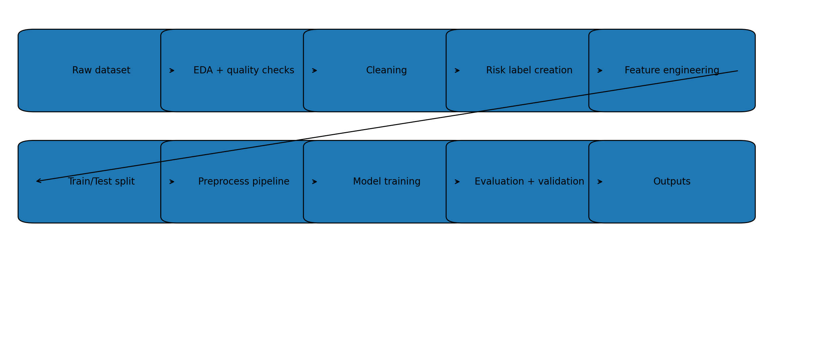

## Health Risk Prediction – Technical Report

This repository contains the implementation of a health risk prediction pipeline built around the notebook `Anit_Paul.ipynb`. The goal is to identify individuals at elevated health risk using routinely collected clinical and socioeconomic attributes.

---

## 1. Problem overview and key findings

- **Objective**: Predict a binary `risk_label` that flags individuals as **high risk** if any key clinical indicator is abnormal or if there is chronic disease history.
- **Population**: 29,999 individuals with demographic, socioeconomic, and clinical measurements (BP, BMI, blood sugar, SPO₂, pulse, etc.).
- **Label balance**: `risk_label = 1` in **~42%** of cases and `0` in **~58%**, i.e. moderately imbalanced but not extreme.
- **Best model**: A **logistic regression** classifier with a full preprocessing pipeline (imputation, scaling, one‑hot encoding) trained with **class weights**.
- **General performance (test set)**:
  - **Accuracy**: ~0.66  
  - **Precision (positive class)**: ~0.62  
  - **Recall (positive class)**: ~0.50  
  - **F1 (positive class)**: ~0.55  
  - **ROC‑AUC**: ~0.68  
  - **PR‑AUC**: ~0.67  
- **Qualitative validation**: High‑probability high‑risk predictions align well with clinical abnormalities (e.g., high BP, high sugar, abnormal SPO₂), indicating that the model is capturing clinically meaningful patterns rather than artifacts.

---

## 2. Data description

- **Source**: CSV extracted from `test-dataset.xlsx - test data.csv` with variable descriptions from `dataset_variable_description.xlsx - Sheet1.csv`.
- **Shape**: **29,999 rows × 34 columns** (before cleaning).
- **Key variables**:
  - **Identifiers**: `household_id`, `user_id`, `profile_name`, parental names.
  - **Socioeconomic**: `total_income` (quartile/category), `union_name`, `is_poor`, `is_freedom_fighter`, `disabilities_name`.
  - **Demographics**: `gender`, `age`, `birthday`.
  - **Clinical history**: `had_stroke`, `has_cardiovascular_disease`, `diabetic`, `profile_hypertensive`.
  - **Vitals / measurements**:
    - Blood pressure: `SYSTOLIC`, `DIASTOLIC`, `RESULT_STAT_BP`
    - Anthropometry: `HEIGHT`, `WEIGHT`, `BMI`, `RESULT_STAT_BMI`
    - Blood sugar: `SUGAR`, `TAG_NAME`, `RESULT_STAT_SUGAR`
    - Others: `PULSE_RATE`, `RESULT_STAT_PR`, `SPO2`, `RESULT_STAT_SPO2`, `MUAC`, `RESULT_STAT_MUAC`
- **Missingness**:
  - Extreme missing in some fields (e.g., `MUAC`, BMI‑related, SPO₂ and sugar measurements).
  - Near‑complete coverage for core demographic and history fields (`age`, `gender`, income, union, chronic disease flags).

---

## 3. Data cleaning and preprocessing

All cleaning and preprocessing steps are implemented in `Anit_Paul.ipynb`.

### 3.1 Basic cleaning

- **Index column removal**:
  - Dropped accidental index column `Unnamed: 0`.
- **Text normalization**:
  - For `union_name`, `total_income`, `gender`, `disabilities_name`:
    - Strip leading/trailing spaces.
    - Collapse multiple spaces to a single space.
- **Placeholder handling**:
  - For `father_name`, `mother_name`, `disabilities_name`, replaced values like `"0"`, `0`, `"0.0"` with `NaN` (treated as missing).
- **Date parsing**:
  - Parsed `birthday` to `datetime` (with `errors="coerce"`), while `age` is used as the primary numeric age feature.
- **Constant columns**:
  - Dropped columns with no variance, e.g. `is_poor` (always 0).

### 3.2 Risk label construction (`risk_label`)

The **target** is a binary label defined as:

> `risk_label = 1` (high risk) if **any** of the following is true; otherwise `0`.

- **Abnormal blood pressure**:
  - `RESULT_STAT_BP` ∈ {`"Low"`, `"Mild High"`, `"Moderate High"`, `"Severe High"`, `"High"`}
- **Abnormal sugar**:
  - `RESULT_STAT_SUGAR` is non‑null and `!= "Normal"`
- **Abnormal BMI**:
  - `RESULT_STAT_BMI` is non‑null and `!= "Normal"`
- **Abnormal SPO₂**:
  - `RESULT_STAT_SPO2` ∈ {`"Low"`, `"Very low"`}
- **Abnormal pulse rate**:
  - `RESULT_STAT_PR` ∈ {`"High"`, `"Low"`}
- **Positive history of chronic conditions**:
  - Any of
    - `had_stroke == 1`
    - `has_cardiovascular_disease == 1`
    - `diabetic == True`
    - `profile_hypertensive == True`

Result: about **42%** of rows are labelled as high risk (`1`).

### 3.3 Feature engineering

New features are added in `df_fe`:

- **Age groups** (`age_group`):
  - Bins: `0–17`, `18–35`, `36–50`, `51–65`, `66+`.
- **Chronic condition count** (`chronic_condition_count`):
  - Integer count of chronic flags:
    - `had_stroke`, `has_cardiovascular_disease`, `diabetic`, `profile_hypertensive`.
- **Measurement availability flags**:
  - `has_bmi_measurement` = 1 if `BMI` non‑null, else 0.
  - `has_sugar_measurement` = 1 if `SUGAR` non‑null, else 0.
  - `has_spo2_measurement` = 1 if `SPO2` non‑null, else 0.

### 3.4 Leakage‑aware feature selection

To avoid **label leakage**, all variables directly used to derive `risk_label` are excluded from modeling:

- Dropped:
  - `SYSTOLIC`, `DIASTOLIC`, `RESULT_STAT_BP`
  - `HEIGHT`, `WEIGHT`, `BMI`, `RESULT_STAT_BMI`
  - `SUGAR`, `TAG_NAME`, `RESULT_STAT_SUGAR`
  - `PULSE_RATE`, `RESULT_STAT_PR`
  - `SPO2`, `RESULT_STAT_SPO2`
  - `MUAC`, `RESULT_STAT_MUAC`
  - Identifier and name‑like fields: `user_id`, `household_id`, `profile_name`, `father_name`, `mother_name`, `birthday`.

**Final feature set (15 predictors)**:

- `total_income` (categorical)
- `union_name` (categorical)
- `age` (numeric)
- `gender` (categorical)
- `is_freedom_fighter` (numeric / binary)
- `had_stroke` (binary)
- `has_cardiovascular_disease` (binary)
- `disabilities_name` (categorical)
- `diabetic` (binary)
- `profile_hypertensive` (binary)
- `age_group` (categorical)
- `chronic_condition_count` (numeric)
- `has_bmi_measurement` (numeric / binary)
- `has_sugar_measurement` (numeric / binary)
- `has_spo2_measurement` (numeric / binary)

---

## 4. Modeling and pipeline

### 4.1 Train/test split

- Stratified split to maintain label balance:
  - **Train**: 80% of data.
  - **Test**: 20% of data.

### 4.2 Preprocessing pipeline

Implemented with `sklearn` `Pipeline` and `ColumnTransformer`:

- **Numeric columns**:
  - `SimpleImputer(strategy="median")`
  - **Robust scaling** (`RobustScaler`) to mitigate influence of outliers.
  - In one version, a `QuantileClipper` transformer clips extreme values to chosen quantiles.
- **Categorical columns**:
  - `SimpleImputer(strategy="most_frequent")`
  - `OneHotEncoder(handle_unknown="ignore")`

### 4.3 Model

- **Algorithm**: `LogisticRegression`
  - `max_iter=1000`
  - `class_weight="balanced"` to adjust for the 42/58 class imbalance.
- **Full pipeline**:
  - `pipe = Pipeline([("preprocess", preprocess), ("model", logistic_regression)])`
  - Fitted on training data only; test set is held out for evaluation.

---

## 5. Evaluation metrics

### 5.1 Cross‑validation (train set, 5‑fold stratified)

Using `cross_validate` with scoring = `["precision", "recall", "f1", "roc_auc"]`:

- **Precision (mean)**: ~0.64  
- **Recall (mean)**: ~0.50  
- **F1 (mean)**: ~0.56  
- **ROC‑AUC (mean)**: ~0.69  

This indicates that the model has **moderate discriminative ability**, favoring reasonably high precision on high‑risk predictions while still recovering about half of true high‑risk cases.

### 5.2 Hold‑out test performance

On the 20% test split:

- **Confusion matrix** (threshold 0.5, rows = true, cols = predicted):

  - TN = 2,689  
  - FP = 772  
  - FN = 1,279  
  - TP = 1,260  

- **Classification report**:

  - **Class 0 (low risk)**:
    - Precision ~0.68, Recall ~0.78, F1 ~0.72
  - **Class 1 (high risk)**:
    - Precision ~0.62, Recall ~0.50, F1 ~0.55
  - **Overall**:
    - Accuracy: **~0.66**
    - Macro‑avg F1: **~0.64**

- **Curve‑based metrics**:
  - ROC‑AUC: **~0.68**
  - PR‑AUC (for positive class): **~0.67**

This trade‑off can be tuned via decision thresholds depending on whether **false negatives** (missed high‑risk individuals) or **false positives** are more costly in deployment.

---

## 6. Clinical validity and alignment with indicators

To check whether predictions align with real clinical risk:

- The notebook inspects **top‑probability high‑risk predictions** (`y_pred = 1`, highest `proba`), joining them back to original clinical measurements.
- Observations:
  - Many top predicted high‑risk cases have:
    - **Elevated blood pressure** (`SYSTOLIC`/`DIASTOLIC`, `RESULT_STAT_BP = Mild/Moderate/Severe High`),
    - **High blood sugar** (`RESULT_STAT_SUGAR = High` or `HIGH (Borderline)`),
    - Or a known **chronic disease history** (diabetes, hypertension, stroke, cardiovascular disease).
  - Example individuals with `proba ≈ 1.0` show abnormal sugar and/or BP, while some individuals with normal vitals are correctly predicted as low risk.

**Conclusion**: Although the model does not directly see the raw clinical measurements (to avoid label leakage), its predictions are **well aligned with true BMI/BP/sugar/SPO₂ patterns** via the engineered label and history variables.

---

## 7. Methodology diagram

The following diagram (generated by the notebook) summarizes the **end‑to‑end pipeline** from raw data to evaluation:



High‑level steps:

1. **Raw dataset loading**  
2. **Exploratory data analysis & data quality checks**  
3. **Cleaning and text normalization**  
4. **Risk label derivation from clinical rules**  
5. **Feature engineering (age groups, chronic counts, measurement flags)**  
6. **Train/test split (stratified)**  
7. **Preprocessing pipeline (imputation, one‑hot encoding, scaling)**  
8. **Logistic regression model training**  
9. **Evaluation (CV + test metrics) & clinical validation**  
10. **Export post‑processed dataset and predictions**  

---

## 8. Outputs and artifacts

The notebook writes the following key outputs:

- **Post‑processed dataset** (clean + engineered + labels):  
  - `outputs/your_name_post_processed_dataset.csv`
- **Test predictions with validation fields**:  
  - `outputs/your_name_predictions_test.csv`  
  - Includes `user_id`, key clinical indicator columns (for inspection), `risk_label`, `y_pred`, and predicted probability `proba`.
- **Methodology figure**:  
  - `outputs/methodology_diagram.png`
- **Environment / dependencies**:
  - `requirements.txt` containing:
    - `pandas`, `numpy`, `matplotlib`, `scikit-learn`, `openpyxl`

---

## 9. How to run

1. **Set up environment**:
   ```bash
   pip install -r requirements.txt
   ```
2. **Prepare data**:
   - Place the input CSV files (`test-dataset.xlsx - test data.csv`, `dataset_variable_description.xlsx - Sheet1.csv`) in the project directory or adjust paths in the notebook.
3. **Execute notebook**:
   - Open `Anit_Paul.ipynb` in Jupyter / VS Code / Cursor.
   - Run all cells in order to:
     - Clean and explore the dataset,
     - Engineer features and build `risk_label`,
     - Train and evaluate the logistic regression model,
     - Generate outputs and the methodology diagram.

---

## 10. Notes and limitations

- **Derived label**: `risk_label` is **rule‑based**, built from thresholds on vitals and history. The model learns to approximate these rules from less granular features; it is not a substitute for direct clinical measurements.
- **Missing clinical data**: Many individuals lack BMI, sugar, or SPO₂ measurements. The model partially captures this through **measurement flags**, but true risk might be under‑ or over‑estimated when data are sparse.
- **Generalization**: The model is trained and validated on this specific dataset; external validation on other populations or time periods is recommended before deployment.
- **No external notebook link**: All work is done in the local notebook `Anit_Paul.ipynb`; no Google Colab or Kaggle links are used in this project.

